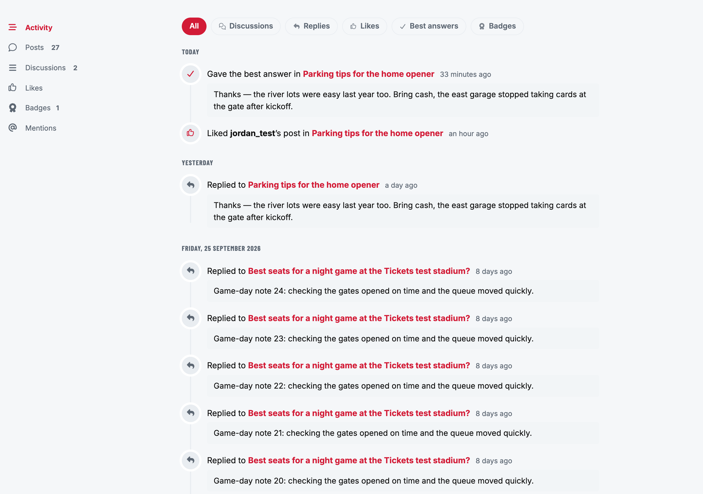
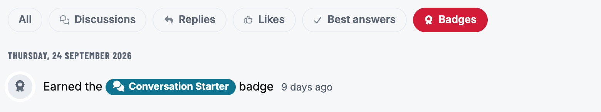
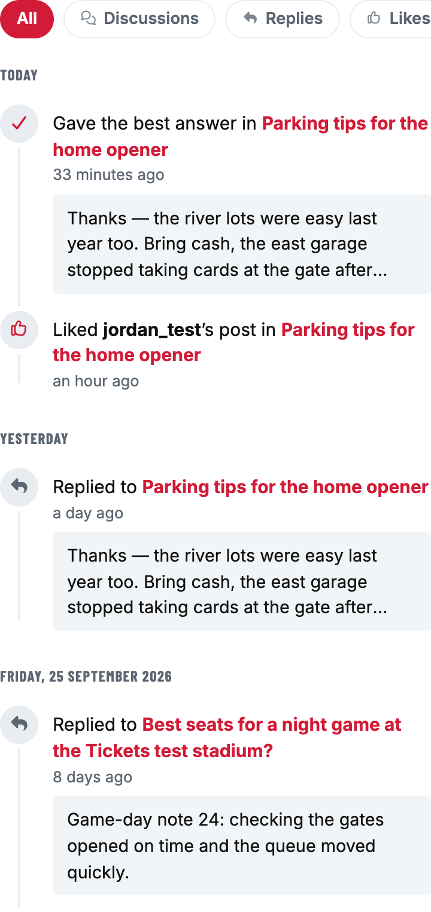
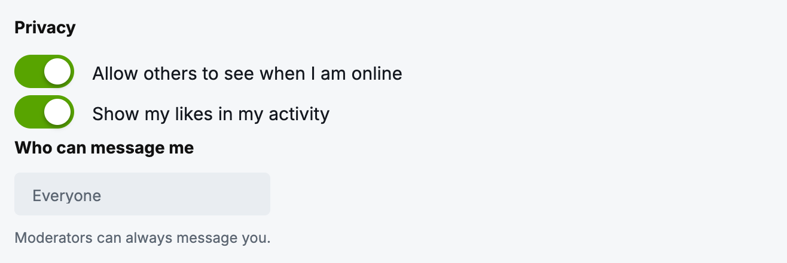
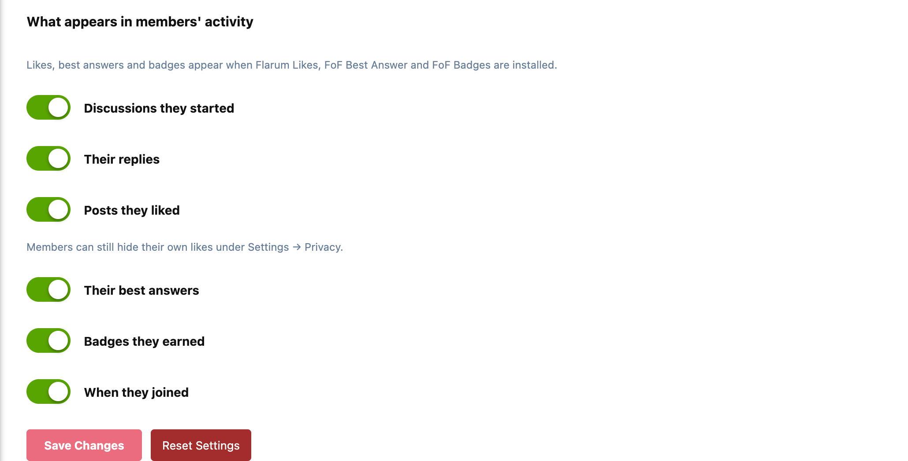

# Chronicle

An Activity tab on every member's profile, the way traditional forums have
always had one: everything they've done, newest first.



The feed shows:

- **Discussions they started**
- **Their replies**, with the first few lines of what they wrote
- **Posts they liked**, with [Flarum Likes](https://github.com/flarum/likes)
- **Best answers**, with [FoF Best Answer](https://github.com/FriendsOfFlarum/best-answer)
- **Badges they earned**, in each badge's own colours, with [FoF Badges](https://github.com/FriendsOfFlarum/badges)
- **When they joined**, as the last line

Items are grouped by day (Today, Yesterday, then the date). A **Load more** button at the end fetches the next page.

## Filters

Chips at the top narrow the feed to one kind of activity. A chip only appears when that kind can show up on the forum.



On a phone the chips scroll sideways in one row:



## Privacy

Chronicle has no activity table of its own. Every item is read from data the forum already keeps, so a member's whole history is there on the day you install it.

Each item is checked against what the **person looking** is allowed to see. A discussion in a restricted tag, a private discussion (FoF Byobu's included) or an unapproved post doesn't appear for anyone who couldn't open it anyway. Hidden posts and hidden discussions are left out for everyone.

Members can keep their likes to themselves with a switch under **Settings → Privacy**:



## Settings

Admin → Chronicle:



- **What appears:** discussions, replies, likes, best answers, badges and the join date, each on or off
- **Permissions → View members' activity:** everyone by default. Members can always see their own.

It uses your theme's own colours, so it fits the default theme, Bespoke and dark mode without styling.

## Good to know

- **No extra load per item.** Each page of 20 items takes one query per kind of activity, plus the discussions and authors they need, loaded together.
- **Paged by time, not by position.** New activity arriving while someone reads doesn't shift the next page or repeat items.
- **Optional extensions stay optional.** Likes, best answers and badges only appear when those extensions are installed and enabled.
- **An API for it.** `GET /api/chronicle/{userId}` returns a page as JSON. Pass `types=reply,like` to filter, and the `before` and `key` values from the previous page's `next` to continue.

## Installation

```bash
composer require ernestdefoe/chronicle
php flarum migrate
php flarum cache:clear
```

Then enable **Chronicle** in the admin panel.

## Updating

```bash
composer update ernestdefoe/chronicle
php flarum migrate
php flarum cache:clear
```

## Discuss

Questions, ideas and release notes: [Chronicle on discuss.flarum.org](https://discuss.flarum.org/d/39990-chronicle).

## Licence

MIT.
